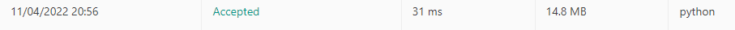

# 125. Valid Palindrome

## solution 1


```python
class Solution(object):
    def isPalindrome(self, s):
        strs = []
        for char in s:
            if char.isalnum(): strs.append(char.lower())
        while len(strs) > 1:
            if strs.pop(0) != strs.pop(): return False
                
        return True
        
```

## solution 2

성능 최적화  : deque 사용하기


```python
from collections import deque
class Solution(object):
    def isPalindrome(self, s):
        strs = deque()
        for char in s:
            if char.isalnum(): strs.append(char.lower())
        while len(strs) > 1:
            if strs.popleft() != strs.pop(): return False
                
        return True
        
```


## solution 3

```python
class Solution:
    def isPalindrome(self, s: str) -> bool:
        strs = s.lower()
        strs = re.sub('[^a-z0-9]' ,'',strs)
        return strs == strs[::-1]
        
```

## solution 4

```python
class Solution:
    def isPalindrome(self, s: str) -> bool:
        arr = []
        for a in s:
            if a.isalpha() or a.isdigit():
                arr.append(a.lower())
        for i in range(0,len(arr)//2):
            if arr[i] != arr[-(i+1)]:
                return False
        
        return True
       
```