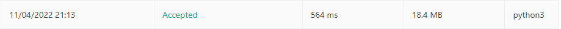

# 344. Reverse String

## solution 1



```python
class Solution:
    def reverseString(self, s: List[str]) -> None:
        left , right = 0 , len(s)-1
        while left < right:
            s[left], s[right] = s[right] , s[left]
            left +=1
            right -=1
        
```

## solution 2

reverse() 함수 사용

```python
class Solution:
    def reverseString(self, s: List[str]) -> None:
        s.reverse()
        
```