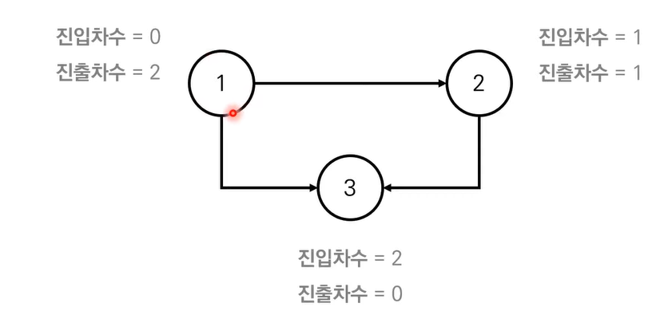

# 위상 정렬

사이클이 없는 방향 그래프의 모든 노드를 방향성에 거스르지 않도록 순서대로 나열하는 것을 의미한다.


- 진입 차수 (Indegree) : 특정한 노드로 들어오는 간선의 개수
- 진출 차수 (Outdegree) : 특정한 노드에서 나가는 간선의 개수




사이클이 없는 방향 그래프 (DAG) 여야 한다.

```python
import sys
from collections import deque

input = sys.stdin.readline

n, m = map(int, input().split())
q = deque()
indegree = [0] * (n + 1)

graph = [[] for _ in range(n + 1)]

for _ in range(m):
    a, b = map(int, input().split())
    indegree[b] += 1
    graph[a].append(b)

for i in range(1,n+1):
    if indegree[i] == 0:
        q.append(i)


while q:
    now = q.popleft()
    print(now , end= ' ')
    for nxt in graph[now]:
        indegree[nxt]-=1
        if indegree[nxt] == 0:
            q.append(nxt)


```