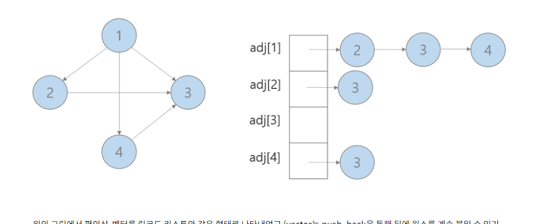

# 파이썬에서 인접 리스트




양방향 그래프, 가중치 


```python
def solution(n, paths, gates, summits):
    graph = [[]  for _ in range(n+1)]
    for i,j,w in paths:
        graph[i].append((j,w))
        graph[j].append((i,w))
   
```