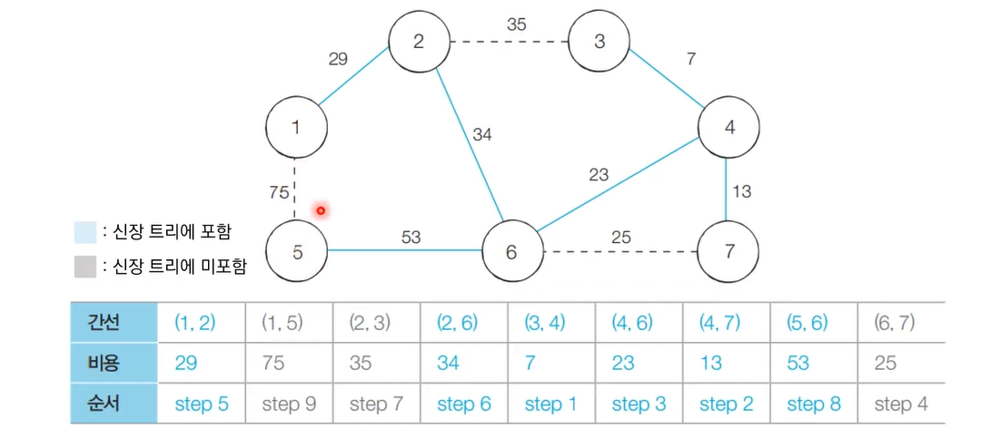

# 최소 신장 트리 (크루스칼 알고리즘)

- 그래프에서 모든 노드를 포함하면서 사이클이 존재하지 않는 부분 그래프




```python
import sys

input = sys.stdin.readline

v, e = map(int, input().split())
tree = []
parent = [i for i in range(v + 1)]


def find(x):
    if x == parent[x]: return x
    parent[x] = find(parent[x])
    return parent[x]


def union(a, b):
    a, b, = find(a), find(b)
    parent[a] = b


for _ in range(e):
    a, b, c = map(int, input().split())
    tree.append((c, a, b))

tree.sort()
n = 0
answer = 0
for a, b, c in tree:
    b,c= find(b),find(c)
    if b!=c:
        union(b,c)
        answer+=a
        n+=1
    if n == v-1:
        break

print(answer)
```