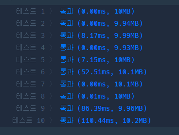
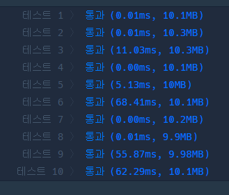
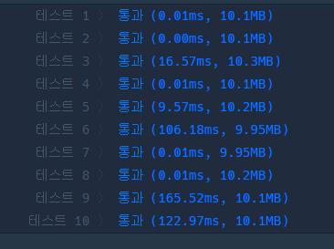

# 프로그래머스 Lv.0 순서쌍의 개수

## solution 1 for 문

```python
def solution(n):
    answer = 0
    for i in range(1,n+1):
        if n % i ==0: answer +=1
    return answer
```


## solution 2 list comprehension

```python
def solution(n):
    return len([e for e in range(1,n+1) if n%e == 0])
```




## solution 3 filter

```python
def solution(n):
    return len(list(filter(lambda x : n% x == 0 , range(1,n+1))))
```

