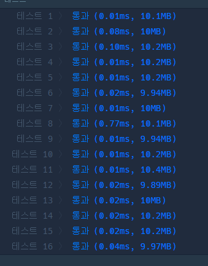

# 프로그래머스 Lv.0 최빈값

## solution 1  dictionary 정렬

```python
from collections import defaultdict
def solution(array):
    answer = 0
    nums = defaultdict(int)
    for a in array: nums[a] +=1
    s_nums = dict(sorted(nums.items() , key = lambda x : x[1] , reverse = True))
    if len(s_nums) == 1:
        return list(s_nums.keys())[0]
    return -1 if list(s_nums.values())[0] == list(s_nums.values())[1] else list(s_nums.keys())[0]
```




## solution 2 set , remove

```python
def solution(array):
    while array:
        for i , v in enumerate(set(array)):
            array.remove(v)
        if i == 0: return v
    return -1
```

## solution 3 Counter

```python
from collections import Counter
def solution(array):
    c = Counter(array)
    d = dict(sorted(c.items() , key = lambda x: x[1] ,reverse = True))
    if len(d) == 1: return list(d.keys())[0]
    if list(d.values())[0] == list(d.values())[1] : return -1
    return list(d.keys())[0]
    
    
```