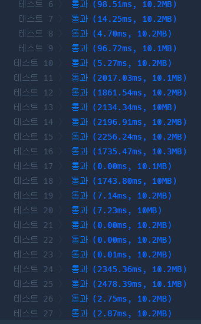
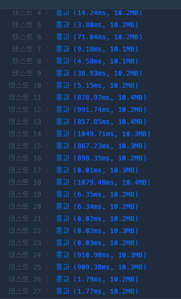

# 프로그래머스 Lv.1 기사단원의 무기

## solution 1



```python
def count(number):
    if number < 3: return number
    cnt = 0
    i = 1
    while(i*i < number):
        if number%i == 0:
            cnt +=2
        i+=1
    if i*i  == number :
        cnt+=1
    return cnt

def solution(number, limit, power):
    answer = 0
    for i in range(1,number+1):
        res  = count(i)
        if res > limit:
            answer += power
        else :
            answer += res
    return answer
```


## solution 2



```python
def count(number):
    arr = []
    for i in range(1 , int(number**0.5)+1):
        if number % i == 0: 
            arr.append(i)
            arr.append(number//i)
    
    return len(set(arr))

def solution(number, limit, power):
    answer = 0
    for i in range(1,number+1):
        res = count(i)
        if res > limit:
            answer+= power
        else:
            answer += res
       
    return answer
```