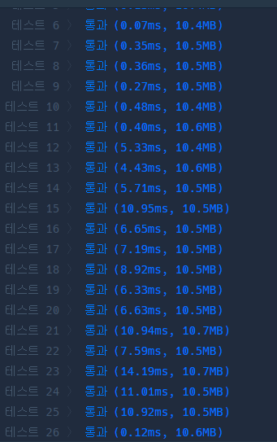
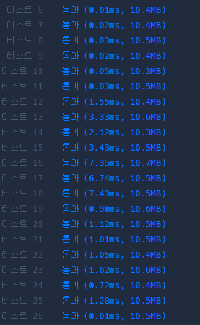
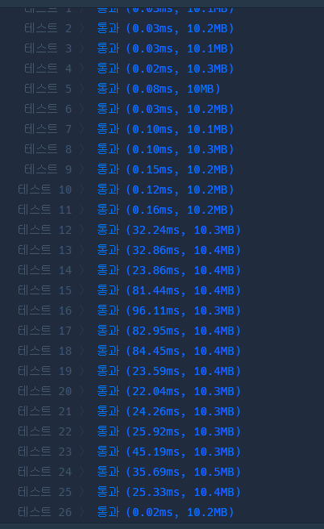

# 프로그래머스 Lv.1 명예의 전당

## solution 1



```python
from queue import PriorityQueue

def solution(k, score):
    answer = []
    pq = PriorityQueue()
    for s in score:
        if pq.qsize() < k:
            pq.put(s)
        else:
            mn = pq.get()
            if mn < s:
                pq.put(s)
            else:
                pq.put(mn)
        v = pq.get()
        answer.append(v)
        pq.put(v)
            
    return answer
```

## solution 2

```python
def solution(k, score):
    q = []
    answer = []
    for s in score:
        q.append(s)
        if len(q) > k:
            q.remove(min(q))
        answer.append(min(q))
            
    return answer
```

## solution 3



```python
import heapq
def solution(k, score):
    pq = []
    answer = []
    for s in score:
        heapq.heappush(pq ,(-s,s))
        answer.append(max(heapq.nsmallest(k,pq))[1])    
    return answer
```