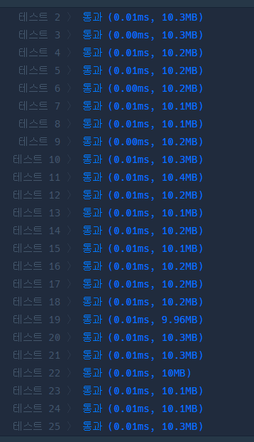
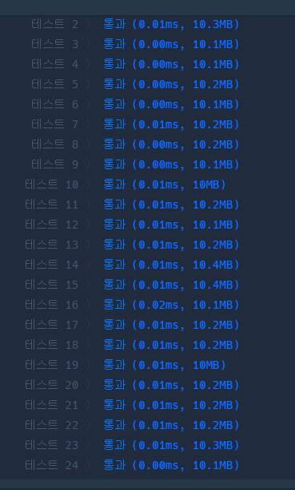

# 프로그래머스 Lv.1 카드 뭉치

## solution 1 스택

```python
def solution(cards1, cards2, goal):
    cards1 = cards1[::-1]
    cards2 = cards2[::-1]
    goal = goal[::-1]
    while goal:
        if cards1 and  goal[-1] == cards1[-1]:
            cards1.pop()
        elif cards2 and goal[-1] == cards2[-1]:
            cards2.pop()
        else:
            break
        goal.pop()
            
    return "No" if goal else "Yes"
```



## solution 2 pop(0)

```python
def solution(cards1, cards2, goal):
    while goal:
        if cards1 and  goal[0] == cards1[0]:
            cards1.pop(0)
        elif cards2 and goal[0] == cards2[0]:
            cards2.pop(0)
        else:
            break
        goal.pop(0)
            
    return "No" if goal else "Yes"
```

