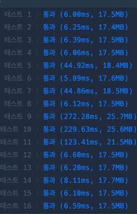
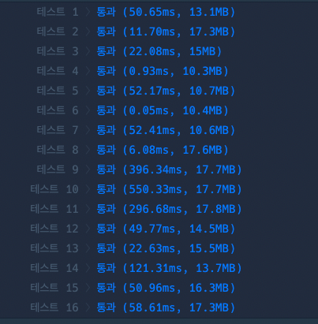

# 프로그래머스 Lv.2 숫자 변환하기

## solution 1  BFS 

```python
from collections import deque

def solution(x, y, n):
    q = deque()
    q.append(x)
    arr = [-1]*(int(1e6)+1)
    arr[x] = 0
    
    while q:
        v  = q.popleft()
        if(v == y): return arr[v]
        if(v+n <= y and arr[v+n] == -1):
            arr[v+n] = arr[v]+1
            q.append(v+n)
        if(v*2 <= y and arr[v*2] == -1):
            arr[v*2] = arr[v]+1
            q.append(v*2)
        if(v*3 <= y and arr[v*3] == -1):
            arr[v*3] = arr[v]+1
            q.append(v*3)
    return -1
```




## solution 2 for 문


```python
def solution(x, y, n):
    dp =  [float('inf')] * (y+1)
    dp[x] = 0
    for idx in range(x,y+1):
        if dp[idx] == float("inf") : continue
        if idx+n <= y:
            if(idx+n == y): return min(dp[idx+n] ,dp[idx]+1)
            dp[idx+n] = min(dp[idx+n] ,dp[idx]+1)
        if idx*2 <= y:
            if(idx*2 == y): return min(dp[idx*2] ,dp[idx]+1)
            dp[idx*2] = min(dp[idx*2] ,dp[idx]+1)
        if idx*3 <=y :
            if(idx*3 == y): return min(dp[idx*3] ,dp[idx]+1)
            dp[idx*3] = min(dp[idx*3] ,dp[idx]+1)
    if dp[y] == float('inf'): return -1
    return dp[y]
```

