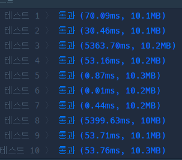
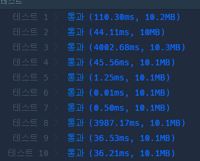

# 프로그래머스 PCCP  모의고사 1  2번

## solution 1  DFS , 백트래킹

```python
answer = 0
def solution(ability):
    global answer  
    n,m = len(ability) , len(ability[0])
    visited = [False]*n
    def dfs(total , depth):
        global answer
        if depth == m:
            answer = max(answer,total)
            return
        
        for idx in range(n):
            if not visited[idx]:
                visited[idx] = True
                dfs(total+ability[idx][depth],depth+1)
                visited[idx] = False
    dfs(0,0)
    return answer
```




## solution 2 permutation

```python
from itertools import permutations
def solution(ability):
    answer = 0
    n,m = len(ability) , len(ability[0])
    for perm in permutations(range(n),m):
        total = 0
        for i, p in enumerate(perm):
            total += ability[p][i]

        answer = max(answer , total)
    return answer
```




## solution 3 permutation , sum

```python
from itertools import permutations
def solution(ability):
    answer = 0
    n,m = len(ability) , len(ability[0])
    for perm in permutations(range(n),m):
        answer = max(answer , sum(ability[p][i] for i ,p in enumerate(perm)))
    return answer
```